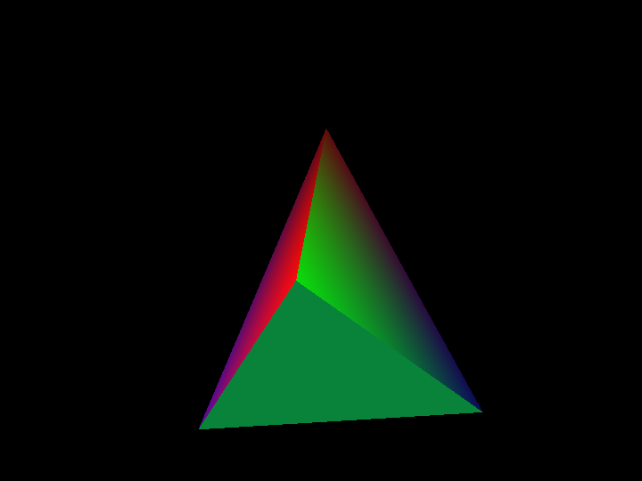

# Shapes

A simple demo using OpenGL 1.1 and [GLFW](http://www.glfw.org/).


## Screenshots





## Prerequisites

* Install the OpenGL, GLU, and GLFW dev libraries:

  ```bash
  sudo apt-get install mesa-common-dev libglu1-mesa-dev libglfw-dev
  ```

* *Optional:* [Install premake4](http://industriousone.com/premake/download)


## Usage

```bash
cd /path/to/project

# Optional: use premake to generate the Makefile
premake4 gmake

make

bin/shapes
```

Use the Up/Down arrow keys to change the number of faces, and the Left/Right arrow keys to change the type of solid.
